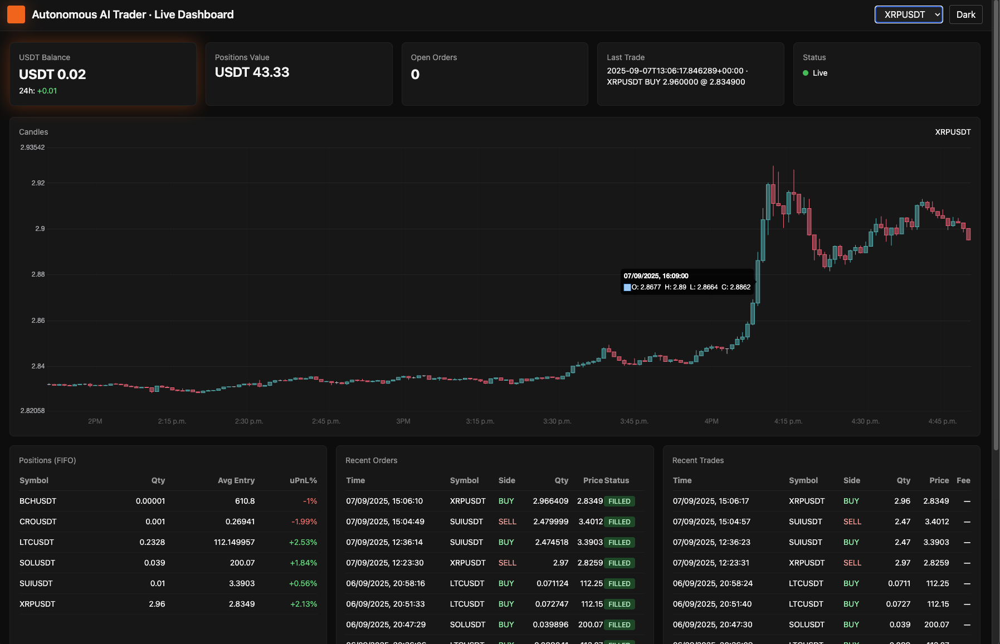

# autonomous-trader
An autonomous crypto trading bot powered by LLMs (large language models).

This bot uses technical indicators and market context to make trading decisions, leveraging the capabilities of LLMs via an Ollama server. It supports both paper trading and live trading modes, with a focus on modularity and ease of customization.

With the enabled currencies, the bot can trade on the MEXC exchange using USDT/USDC pairs. In it's default configuration, it trades SOLUSDT, SUIUSDT, BCHUSDT, LTCUSDT, and XRPUSDT on 1-minute intervals.  It would fetch the 1 minute candles, with a 600 minute lookback period, compute technical indicators, and use the LLM to decide whether to buy, sell, or hold based on the current market conditions and its existing positions.

The decision-making process involves analyzing various technical indicators such as moving averages, RSI, MACD, and VWAP, as well as higher timeframe trends. The bot maintains a PostgreSQL database to store historical candle data and uses asyncio for concurrent operations.

Based on the LLM's recommendations, the bot executes trades through the MEXC API, adhering to predefined risk management and position sizing rules. It also includes logging and error handling to ensure robust operation.

## Features
- Uses LLMs to make trading decisions based on technical indicators and market context.
- Paper trading and live trading modes.
- Configurable trading strategies and parameters.
- Stores historical data in a SQLite database.
- Modular design for easy extension and customization.
- Uses asyncio for concurrent operations.
- Logging and error handling for robust operation.
- Dockerized for easy deployment.

## Requirements
- Docker and Docker Compose (or podman and podman-compose)
- An Ollama server running locally or accessible remotely for LLM inference.
- API keys for the exchange you want to trade on (if using live mode).

## Setup
1. Clone the repository:
   ```bash
   git clone https://github.com/yourusername/autonomous-trader.git
   cd autonomous-trader
   ```
2. Create a `.env` file based on the provided `.env.example` and fill in your API keys and other configurations.
3. Modify the `trader/config.json` file to set your trading parameters, symbols, and other settings.
4. Ensure you have an Ollama server running and accessible.
5. Build and run the Docker container:
   ```bash
   docker-compose up --build
   ```
   Or, if using podman:
   ```bash
   podman-compose up --build
   ```
6. Monitor the logs to see the bot's activity.

## configuration
- `trader/config.json`: Main configuration file for the bot. Set your trading symbols, intervals, exchange settings, and execution parameters here.
- `.env`: Environment variables for sensitive information like API keys.

## Usage
- The bot will start in paper trading mode by default. To switch to live trading, change the `mode` in the `.env` file to `live`.
- Monitor the logs for trading activity and decisions made by the LLM.
- Adjust the configuration as needed to optimize your trading strategy.

## Sample Output
```
[SOLUSDT] 🔄 HOLD price=203.250000 conf=0.52 last_ts=2025-09-07T10:57:00+00:00 reason=neutral momentum and trend indicators
[SUIUSDT] 🔄 HOLD price=3.393200 conf=0.52 last_ts=2025-09-07T10:57:00+00:00 reason=above avg; DCA rule
[SOLUSDT] 🔄 HOLD price=203.250000 conf=0.52 last_ts=2025-09-07T10:58:00+00:00 reason=neutral momentum and alignment with HTF trends
[XRPUSDT] 🔄 HOLD price=2.830000 conf=0.52 last_ts=2025-09-07T10:58:00+00:00 reason=Neutral momentum and trend indicators suggest holding position.
[XRPUSDT] 🔄 HOLD price=2.830000 conf=0.52 last_ts=2025-09-07T10:59:00+00:00 reason=Neutral momentum and trend signals with no strong buying or selling conditions.
[XRPUSDT] ➕ BUY price=2.830700 conf=0.65 last_ts=2025-09-07T10:59:00+00:00 reason=Positive momentum and trend signals
[XRPUSDT] ➕ BUY price=2.830800 conf=0.70 last_ts=2025-09-07T11:00:00+00:00 reason=positive momentum and alignment with HTF trend
[XRPUSDT] ➕ BUY price=2.830700 conf=0.65 last_ts=2025-09-07T11:01:00+00:00 reason=Positive momentum and trend signals
[XRPUSDT] ➕ BUY price=2.831100 conf=0.65 last_ts=2025-09-07T11:03:00+00:00 reason=Momentum and trend indicators suggest a buy opportunity.
```

## Dashboard
A simple dashboard is available to visualize the bot's performance and trading activity.
The dashboard can be accessed at `http://localhost:8080` (or the port you configured in the docker-compose file).

Screenshot of the dashboard:


## Contributing
Contributions are welcome! Please fork the repository and submit a pull request with your changes.

## License
This project is licensed under the MIT License. See the `LICENSE` file for details.

## Disclaimer
This bot is for educational purposes only. Trading cryptocurrencies involves significant risk, and you should not trade with money you cannot afford to lose. Always do your own research and consider consulting with a financial advisor before engaging in live trading.


